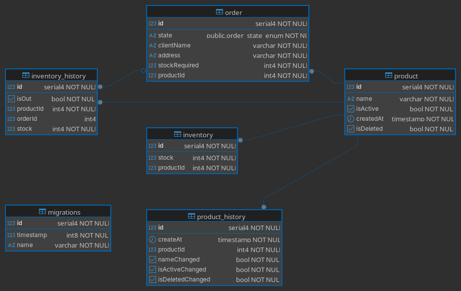

**IMPORTANTE: el proyecto no se probó en un entorno con windows, solo en linux.**

# Instrucciones de instalacion

## Dependecias

El proyecto usa:

- nodejs v20
- npm v10.8.2
- docker
- nvm (opcional)

## instalacion

El proyecto utilizo nvm para manejar las versiones de nodejs, para instalacion y configuracion consulte
[instalacion de nvm](https://github.com/nvm-sh/nvm?tab=readme-ov-file#installing-and-updating), una vez configurado la version de nodejs especificada, siga con la instalacion.

Para clonar el repositorio utilice en local.

```
git clone git@github.com:zer4c/InventarioFavorcito.git
```

Para instalacion de dependencias utilice:

```
npm install
```

## Variables de Entorno

Las variables de entorno requeridas para el proyecto estan en **.env.example**, para configurar crea un nuevo archivo **.env**, copie el contenido y personalice las variables de entorno, si ejecutará la aplicacion en local cambie:

```
DB_HOST=postgres a DB_HOST="localhost"
```

## Script para creación de base de datos

El proyecto implementó migraciones de la base de datos, para esto necesita ejecutar en su terminal:

```
docker-compose up
```

Esto levantara dos bases de datos postgres, una para nuestras peticiones desde la api y otra para las pruebas de caja negra.

Al ejecutar

```
npm run dev
```

Las migraciones se ejecutaran automaticamente creando la tablas de las base de datos necesarias.

El proyecto no cuenta con seeds para poblado de la base de datos.

## Swagger

Si el server esta levantado en localhost y con la informacion de env.example predeterminado, la ruta sera:

```
localhost:3000/docs/
```

## Comandos utiles

Para correr los test utilice

```
npm run test
o
npm run test:e2e
o
npm run test:unit
```

para generar migraciones

```
npm run migrate:generate -- "./migrations/nombremigracion"
```

# Explicación de decisiones técnicas

Algunas desiciones tecnicas se explicaran en las medidas de seguridad.

## Arquitectura

Como era un proyecto "pequeño", entonces se utilizo una arquitectura MVC (modelo vista controlador).

El proyecto esta organizado por modulos, para la logica de negocio.

```
src/
 |config
 |core
 |docs
 |middleware
 |modules/
 | |product/
```

## Manejo de base de datos

En el proyecto se utiliza un ORM para peticiones a la base de datos, esto para que no haya inyecciones SQL.

Entre varios ORM se eligió typeORM, esto por que ya tiene una implementacion facil con typescript, otro ORM como por ejemplo Sequelize no encontre mucha documentacion e informacion para manejarlo rapidamente con typescript, ya que algunos archivos de configuracion daban error con typescript.

## Justificación del diseño de base de datos

Tenemos diagrama de la base de datos



Explicando la funcion de cada entidad. (La logica de negocio se explicara mas adelante)

- order : Aqui se guardan todas las peticiones de ordenes, como es gestion de inventario, supuse que era para compras, ordenes de compra especificamente. Entonces se guarda el nombre, direccion, cantidad de stock, producto que quiera comprar y un estado de orden.

- product : Se guarda toda la informacion de un producto en cuestion, para simplficarlo solo le puse nombre, aunque se podria añadir precio, fabrica, etc.

- inventory : Es una extension de product, para guardar la cantidad de stock que existe de ese mismo.

se pidio que se guarde cualquier cambio, como:

- cambios de informacion de un producto
- entradas y salidas del inventario

como inventario es una tabla transaccional, una que cambia frecuentemente, mejor guardar esos cambios aparte de los cambios de informacion de un producto.

por eso se crean las dos tablas:

- inventory_history : Que guarda todos los cambios de stock, entradas como salidas.
- product_history : Que guarda todos los cambios de de informacion de un producto.

### Logica de Base de datos

- Las ordenes tienen estados, segun como quede la peticion siempre se crean, estas ordenes son las que quitan stock de un producto, para añadir stock, directamente se utiliza los metodos presentados por inventario

- Los cambios hechos en un producto, solo muestran que cambio y cuando, pero no contienen la informacion cambiada.

- Tambien, se puso isDeleted en product, esta medida se hizo para que no se borre informacion de la base de datos, por que al ser un inventario y se registra todo, por seguridad solo se "desactiva".

## Manejo de errores y respuestas

Los errores solo siguieron un patron, todas devuelven:

```
{
  detail: "mensaje de error",
  ok: false,
}
```

Las respuestas tambien siguieron un patron:

```
{
  detail: "mensaje de informacion",
  ok : true,
  data : "Datos dela peticion"
}
```

Los errores comunes estan manejados por dos middlewares, uno especifico para la validacion de datos con zod, el otro para los errores de "EntityNotFound" y para errores inesperados.

# Medidas de seguridad implementadas

## Inyeccion SQL

Para evitar esto, utilizamos un ORM, pero en algunos casos podria venir por un query param, pero como hacemos +id, genera un error, antes de ejecutar una inyeccionSQL.

## Manipulacion de Payload y datos malformados

Utilizo schemas zod, para validar todas las entradas del body de la request, como por ejemplo el estado de una orden, zod lanza error por campos que no estan definidos en su schema, Tambien esto previene datos malformados, ya que zod verifica el tipo de dato y la calidad del dato, como por ejemplo longitud, espacios, valores negativos en caso de los numeros.

## Exposicion de informacion sensible

En este proyecto aunque no habia "informacion sensible" como tal, si se implemento de igual manera con los schemas zod, que filtran informacion de filas resultantes de la base de datos que no se requiere que se vea, como por ejemplo isDeleted de un producto.

## Errores que filtren informacion interna

Todos los errores, se van filtrando, si no llega aun filtro de manera automatica llegara a ser un error 500 **internal server error**
